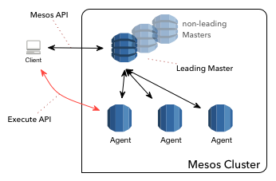

============================================
Operators Module - Remote Commands Execution
============================================

:Author: Marco Massenzio (marco@alertavert.com)
:Revision: 0.2
:Created: 2015-12-15
:Updated: 2015-12-20

Motivation
----------

We wish to enable operators to execute remotely arbitrary commands on Apache
Mesos Agent/Master nodes, out-of-band from the normal task execution framework.

For more information, please consult the references listed in `Prerequisites`_.

Goals
-----

This is a `Mesos anonymous module`_ which can be loaded using the enclosed
``modules.json`` descriptor; this module will add `Endpoints`_ such
that:

- we can monitor the status (active/inactive) of this module;
- we can remotely execute arbitrary (shell) commands, with optional arguments;
- we can retrieve the outcome of the command;
- we can terminate previously launched processes.

This is **not** meant to offer full remote shell functionality, however.

License & Allowed Use
---------------------

The code in this repository is **not released under an Open Source license**.

  This code is (c) 2015 AlertAvert.com.  All rights reserved.

This *may* change in due course, but currently the only allowed use is for
training and learning purposes: the code is meant to be used by developers of
Mesos Modules to learn how to create their own module.

We explicitly disallow usage of this code, or any derivation thereof, in any
commercial software deployed in Production for use by external users
(regardless of whether the intended use).

If you wish to use this code in Production and/or modify it, please contact
the author directly at the following address::

  marco (at) alertavert (dot) com

Endpoints
---------

API
^^^

You can retrieve the status of this module::

  GET /remote/status

Returns a `200 OK` response if this module is active::

    200 OK

    {
        "release": "0.2.0-d94e907",
        "result": "ok",
        "sandbox_dir": "/mnt/mesos/sandbox",
        "status": "active",
        "work_dir": "/tmp/agent"
    }

If it's active, you can execute ``command`` remotely on the Agent::

  POST /remote/execute

  Request format: RemoteCommandInfo

  {
      "command": "ls",
      "shell": false,
      "arguments": ["-la", "/tmp"],
      "timeout": 10
  }

``command``
  The binary command to execute; must be in the Agent's execution ``$PATH``
  and the user running the Agent **must** have the required permissions to
  execute it.

``shell``
  If ``true`` the ``command`` will be executed inside a shell process
  (in other words, we will execute something similar to ``sh -c command``).

``arguments``
  An array of strings that will be passed verbatim (i.e., without any
  escaping or variable substitution) to ``command``. [1]_

``timeout``
  In seconds, to wait for the command to complete: if ``timeout`` is
  exceeded, the implementation will try and kill the process (sending a
  ``SIGTERM`` signal) and the ``Future`` will be completed.

The request executes a command on the Agent asynchronously; the response will
contain the process's PID, that can be used afterwards to recover the
outcome of the command (if any)::

  200 OK

  {
      "result": "OK",
      "pid": 6880
  }

To retrieve the outcome of the command [2]_ ::

  POST /remote/task

  {
      "pid": 6880
  }

Will return a ``RemoteCommandResult`` response encoded in JSON::

  200 OK

  {
    "exitCode": 0,
    "signaled": false,
    "stderr": "",
    "stdout": "total 1972\ndrwxr-xr-x  4 marco   marco     4096 Dec 20 14:28 agent
              ...\ndrwxrwxrwt  2 root    root      4096 Dec 17 16:06 .X11-unix\n"
  }

If the command errors out it will result in an ``exitCode`` different from
``EXIT_SUCCESS`` (0) and if it times out, it will be in the ``signaled``
state with the ``exitCode`` the value of the signal (most likely ``SIG_KILL``
or 9, as it was killed by the ``cleanup()`` method) [3]_ ::

    POST /remote/task

    {
        "pid": 1373
    }

may return::

    200 OK

    {
      "exitCode": 2,
      "signaled": false,
      "stderr": "ls: cannot access /foo/bar: No such file or directory\n",
      "stdout": ""
    }

Finally, to get the list of currently running and executed processes::

  GET /remote/task

will return a list of valid ``pids`` to query for::

  200 OK

  {
      "pids": [12141, 12454, ... 12144]
  }

Build
-----

Prerequisites
^^^^^^^^^^^^^

You obviously need `Apache Mesos`_ to build this
project: in particular, you will need both the includes (``mesos``, ``stout``
and ``libprocess``) and the shared ``libmesos.so`` library.

In addition, Mesos needs access to ``picojson.h`` and a subset of the ``boost``
header files: see the
`3rdparty <https://github.com/apache/mesos/tree/master/3rdparty/libprocess/3rdparty>`_
folder in the mirrored github repository for Mesos, and in particular the
`boost-1.53.0.tar.gz <https://github.com/apache/mesos/blob/master/3rdparty/libprocess/3rdparty/boost-1.53.0.tar.gz>`_
archive.

The "easiest" way to obtain all the prerequisites would probably be to clone the Mesos
repository, build mesos and then install it in a local folder that you will then need to
configure using the ``LOCAL_INSTALL_DIR`` property (see `CMake`_ below).

Finally, you need the ``libsvn`` library (this is required by Mesos): on OSX
this can be obtained using ``brew``::

    brew install svn

Google Protocol Buffers
^^^^^^^^^^^^^^^^^^^^^^^

Apache Mesos makes extensive use of `Protocol Buffers <https://developers.google.com/protocol-buffers>`_
and this project uses them too (see the ``proto/execute.proto`` file).

In order to build this module, you will need to download, build and install Google's protobuf
version **2.5.0** (this is the most recent version used by Mesos - using a more recent one will
cause compile and runtime errors) - see the link above for more details.

We assume that the ``protoc`` binary will be installed in the same ``LOCAL_INSTALL_DIR`` location;
assuming that this is set to be the ``$LOCAL_INSTALL`` env variable::

    cd protobuf-2.5.0/
    ./configure --prefix $LOCAL_INSTALL
    make -j 4 && make install

see the protobuf documentation for more info.

CMake
^^^^^

This module uses `cmake <https://cmake.org>`_ to build the module and the
tests; there are currently two targets: ``execmod`` and ``execmod_test``, the
library and the tests, respectively.

It also needs a number of libraries and header files (see `Prerequisites`_)
that we assume to be in the ``include`` and ``lib`` subdirectories of a
directory located at ``${LOCAL_INSTALL_DIR}``; this can be set either using
an environment variable (``$LOCAL_INSTALL``) or a ``cmake`` property
(``-DLOCAL_INSTALL_DIR``)::

    mkdir build && cd build
    cmake -DLOCAL_INSTALL_DIR=/path/to/usr/local ..
    make

    # If you want to run the tests in the execmod_test target:
    ctest

Usage
-----

See the `Mesos anonymous module`_ documentation for more details; however, in
order to run a Mesos Agent with this module loaded, is a simple matter of
adding the ``--modules`` flag, pointing it to the generated JSON
``modules.json`` file (the `CMake`_ step will generate it in the ``gen/``
folder) [4]_ ::

  $ ${MESOS_ROOT}/build/bin/mesos-slave.sh --work_dir=/tmp/agent \
      --modules=/path/to/execute-module/gen/modules.json \
      --master=zk://zk1.cluster.prod.com:2181

See ``Configuration``  on the `Apache Mesos`_ documentation pages for more
details on the various flags.

Also, my `zk_mesos`_ github project provides an example `Vagrant`_
configuration showing how to deploy and run Mesos from the Mesosphere binary
distributions.

Agent Flags
^^^^^^^^^^^

If `MESOS-4253`_ is accepted and the `code`_ committed, the module will also gain access to the 
Agent's flags, and in particular to ``--work_dir`` and ``--sandbox_dir`` that could be further used
when executing commands to store logs, etc.

See the ``init()`` method in the ``RemoteExecutionAnonymous`` class.

Tests
-----

Run ``ctest`` from the ``build`` directory, or launch the `execmod_test`
binary::

    cd build && ./execmod_test

--------

*Notes*

.. [1] In other words, using ``{"command": "echo", "arguments": ["$PATH"]}``
       will result in ``{"exitCode": 0, "stdout": "$PATH\n"}``.

.. [2] It is currently not possible to create a *RESTful API* using ``libprocess``
       ``Process::route()`` method, as it's not possible to create routes with wildcard
       URLs (such as ``/remote/task/.*``) as in other HTTP frameworks.
       (see `process.cpp`_ for more details, and in particular the `handlers`_
       ``struct``).

.. [3] Note that even in the case the command itself failed, the response code
       is stiil a ``200 OK``::

.. [4] Make sure that the ``"file"`` field in the JSON points to the correct location
       (**on the Agent node**) where the ``libexecmod.so`` file is located; watch out
       for erros in the Agent's log.

.. _Mesos anonymous module: http://mesos.apache.org/documentation/latest/modules/
.. _Apache Mesos: http://mesos.apache.org
.. _zk_mesos: http://github.com/massenz/zk_mesos
.. _Vagrant: https://www.vagrantup.com/
.. _process.cpp: https://github.com/apache/mesos/blob/master/3rdparty/libprocess/src/process.cpp#L3319
.. _handlers: https://github.com/apache/mesos/blob/master/3rdparty/libprocess/include/process/process.hpp#L359
.. _MESOS-4253: https://issues.apache.org/jira/browse/MESOS-4253
.. _code: https://reviews.apache.org/r/41760/
